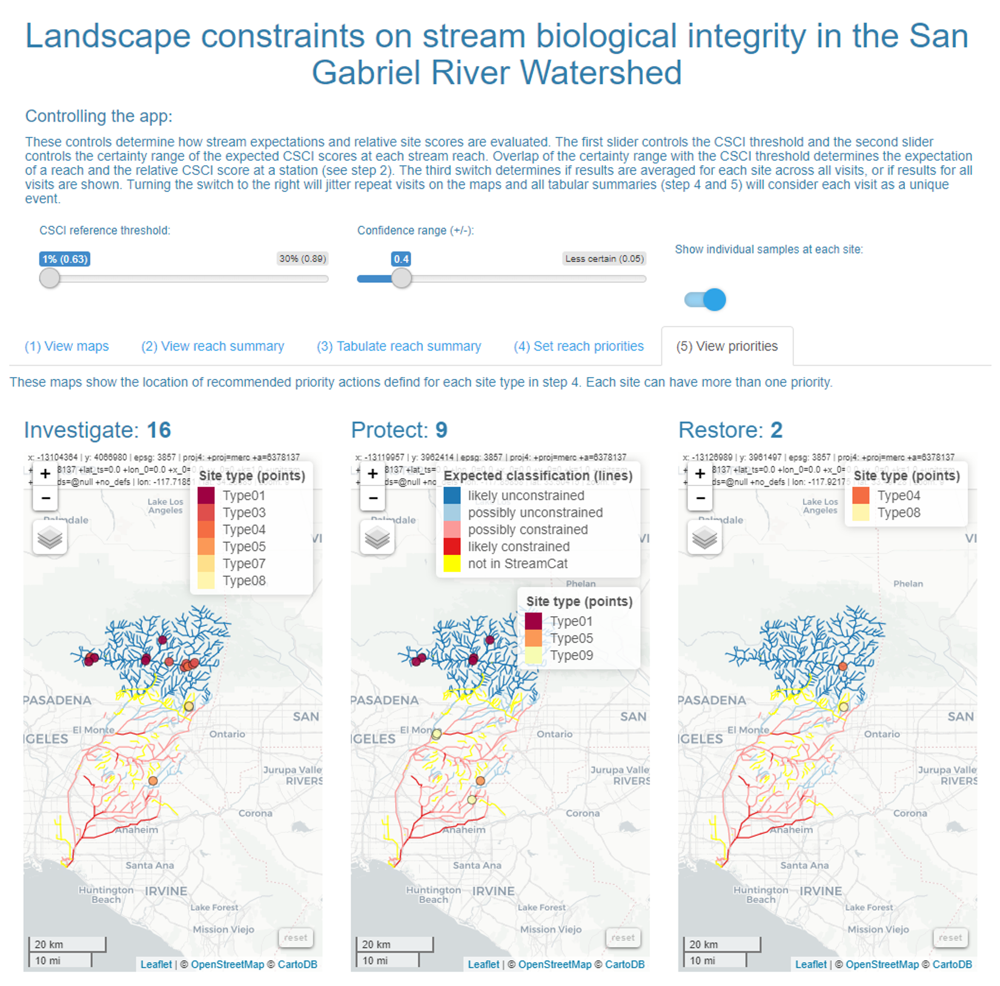

# README

Marcus W. Beck, [marcusb@sccwrp.or](mailto:marcusb@sccwrp.org)

View the [app](https://beckmw.shinyapps.io/sgrrmp_classify/)

This application can be used to explore landscape constraints on biological integrity of streams in the San Gabriel River Watershed.  The application provides context for evaluating stream health by estimating an expectation of biological condition at a given stream reach relative to landscape drivers. Biological condition from field data using the California Stream Condition Index can be compared to the reach expectation.  The process begins by identifying stream classifications and expectations from user-defined parameters for CSCI thresholds and confidence in the biological expectation. Stream classifications of expected biological constraints are defined as likely unconstrained, possibly unconstrained, possibly constrained, and likely constrained.  Observed CSCI scores at a site are then characterized relative to the reach expectations as over-scoring, expected, or under-scoring.  Relative site scores given the expectation can be used to recommend priorities for management actions.

